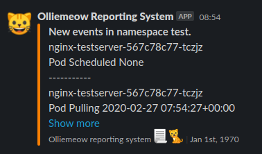

# Olliemeow

Olliemeow: Kubernetes namespace change reporter



## Operation

Olliemeow is prepared to be installed via Helm Chart directly into a kubernetes cluster.

Chart includes templates to create necessary access rights.

```
helm install olliemeow chart/olliemeow -n [namespace_name] --set configMap.slack_url=[slack_hook_url]
```

## Slack configuration

In the Slack apps integration configuration page, an administrator can create a new application, define to which Slack channel will it post received updates and get the slack_hook_url required for the command stated in the previous section.
